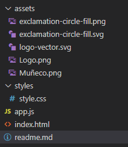

# SUMARIO


- [SUMARIO](#sumario)
  - [Introduccion](#introduccion)
  - [Instalacion y Uso](#instalacion-y-uso)
  - [Estructura de Carpetas](#estructura-de-carpetas)
  - [Caracteres No Permitidos](#caracteres-no-permitidos)
  - [Codigo para el ClipBoard API](#codigo-para-el-clipboard-api)
  - [Variables de Entorno (.Env)](#variables-de-entorno-env)
  


## Introduccion

Se realiza un proyecto Challenge para el curso de capacitación  ***ONE*** de ***ALURA LATAM*** y ***ORACLE***.

Este proyecto consiste en un encriptador y desencriptador de texto en base a reglas y plantillas proporcionadas por los tutores

Instructor ***Ing. Jeanmarie Quijada***

## Instalacion y Uso

* instalar VSCode y GitHub
* clonar el repositorio con  
  
  > git clone [url]

* excribir el texto a Encriptar o a Desencriptar (sin incluir caracteres epeciales o letras acentuadas)
* presionar el boton correspondiente (**ENCRIPTAR** / **DESENCRIPTAR**)
* se mostrarará el resultado en el recuadro de la derecha
* el resultado puede copiarse al portapapeles con el botón **COPIAR** para volver a utilizarlo con **CTRL+V**


## Estructura de Carpetas



## Caracteres No Permitidos

``` javascript

const lista_de_caracteres_especiales = [
    '´','!', '@', '#', '$', '%', '^', '&', '*', '(', ')', '-', '_', '=', '+', '[', ']', '{', '}', '\\', '|', ';', ':', '\'', '"', ',', '.', '<', '>', '/', '?', '`', '~'
  ];

const lista_vocales_acentuadas = [
    'á', 'é', 'í', 'ó', 'ú', 'ü', 'ñ', 'Á', 'É', 'Í', 'Ó', 'Ú', 'Ü', 'Ñ'
  ];

const lista_letras_mayusculas = [
    'A', 'B', 'C', 'D', 'E', 'F', 'G', 'H', 'I', 'J', 'K', 'L', 'M', 'N', 'Ñ', 'O', 'P', 'Q', 'R', 'S', 'T', 'U', 'V', 'W', 'X', 'Y', 'Z', 'Á', 'É', 'Í', 'Ó', 'Ú', 'Ü'
  ];

```

## Codigo para el ClipBoard API
```javascript

let botonCopiar=document.querySelector(".desktop2__rectangulo__boton__copiar");

botonCopiar.addEventListener('click',()=> escribirClipboard(document.querySelector("#textarea__dos").value));


botonCopiar.addEventListener('click',()=>{
  
  let textoResaltar=document.querySelector("#textarea__dos")
  
  textoResaltar.select();
});


async function escribirClipboard(texto){
  try {
    await navigator.clipboard.writeText(texto);
  } catch(error){
    console.error(error);
  }
}


```

## tamanos de pantalla (responsividad y media queries)

* para pantallas de hasta 768px de ancho 

```css

@media (max-width: 768px)

```

* para pantallas desde 768px hasta 1200px de ancho 

```css

@media (max-width: 1200px)

```


## Variables de Entorno (.Env)

URL de GitHub

> https://github.com/correoCappelli/Encriptador_De_Texto---ONE-ALURA-ORACLE.git

